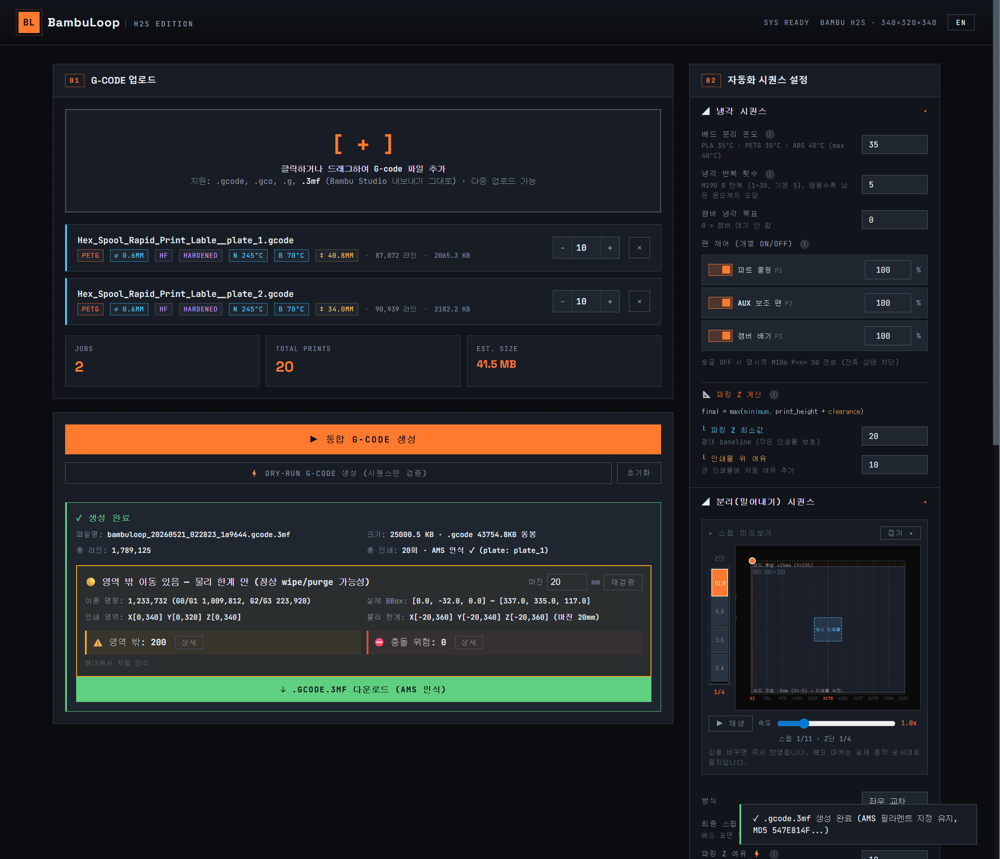

# BambuLoop

> English README: [README.md](README.md)



<details>
<summary>실제 프린팅 데모 GIF 보기</summary>


</details>

### **BambuLoop은 BambuLab H2S의 반복 인쇄를 위한 자동 프린팅 팜 웹 도구 입니다**

같은 모델 (또는 다른 여러 모델) 을 사람이 프린터를 만지지 않고 스스로 제거하고 계속 반복 인쇄합니다.
BambuLoop은 슬라이싱된 파일 여러 개를 하나의 G-code로 합쳐서, 인쇄 → 냉각 →
헤드로 인쇄물 스윕&분리 → 다음 인쇄를 자동으로 반복합니다.

---

## 동작 방식

```
[슬라이싱된 모델 G-code] × N회 반복
   ↓
  인쇄 → 냉각 → 분리 (노즐 스윕) → 재가열 → 퍼지 → 다음 인쇄
   |                                                 ↓
   └─────────────────── 반복 ────────────────────────┘
```

추가 하드웨어 필요 없습니다. 노즐 헤드 자체가 완성된 인쇄물을 베드에서 밀어냅니다.

---

## 추천 빌드 플레이트

자동 분리가 안정적으로 동작하려면 **저온 분리 (cold-release)** 빌드 플레이트 사용을 추천합니다.

**[CryoNix Cold Build Plate](https://ko.aliexpress.com/item/1005009240815983.html)** 추천:

- 매끄러운 PUR 코팅 — 베드가 식으면 인쇄물이 자동으로 떨어짐
- 프린터를 기울이거나 스크래핑할 필요 없음 — 노즐이 가볍게 밀어내기만 하면 분리됨
- 저온 인쇄 (PLA 25–45°C) 와 일반 인쇄 모두 지원

Bambu의 기본 금색 텍스처 PEI 플레이트도 동작은 하지만, 더 낮은 냉각 온도와 더 강한
분리력이 필요합니다.

> 위 링크는 제휴 제품이 아니며, 단순히 직접 사용해본 결과로 추천입니다.

---

## 설치

**Python 3.10 이상** 필요.

```bash
git clone https://github.com/kiwinux/BambuLoop.git
cd BambuLoop
pip install -r requirements.txt
```

---

## 빠른 시작

### 1. 웹 UI 서버 실행

```bash
python app.py
```

브라우저에서 <http://localhost:5000> 열기.

### 2. G-code 업로드

**Bambu Studio**에서 아래 메뉴를 통해 슬라이싱한 뒤 내보내기를 합니다:

- **플레이트 → 3MF로 슬라이싱된 파일 내보내기** → `.gcode.3mf`

`.godfe.3mf` 파일을 BambuLoop 브라우저 UI에 드래그하세요. 여러 파일을 한꺼번에 드롭할 수 있습니다.

### 3. 반복 횟수 설정

각 모델마다 몇 번 인쇄할지 설정합니다.

### 4. 분리 방식 선택

기본값 `edge_to_center` 가 대부분의 경우에 잘 작동합니다. 인쇄물이 낮은 경우
__**(단, 높이 42mm 미만인 경우에만)**__ 에는 `bottom_only` 또는 `edge_to_center_bottom` 을 시도해
보세요 — 분리력이 베드 가까이에 집중됩니다. 

### 5. (옵션) 먼저 드라이런 테스트 실행

Dry-Run 테스트를 통해 실제 인쇄 없이 자동화 시퀀스
(냉각 → 분리 → 재가열 → 리셋) 만 진행하는 테스트 G-code가 생성됩니다.

이 테스트를 통해 스윕 모션이 안전한지 확인 할 수 있습니다.

### 6. 생성 후 프린터로 전송

**Generate** 버튼을 누르세요. `.gcode.3mf` (또는 `.gcode`) 파일을 다운로드합니다.

평소처럼 프린터에 전송하세요 — Bambu Studio에서 파일을 열어  "프린터로 전송" 하거나 USB로 파일을 출력하면 됩니다.

---

## 첫 실행 팁

- 처음 사용해본다면, **반복 횟수를 작게 시작** (예: 3회) 해서 빌드 플레이트에서 정상적으로 떨어지는지 확인 해보세요.
- **첫 사이클 전체를 직접 지켜본 뒤** 자리를 비우세요.

---

## 설정

오른쪽 패널에 모든 설정이 있습니다. 이미 기본값이 설정되어 있고 즉시 사용 가능한 상태입니다.

ⓘ 아이콘에 마우스를 올리면 각 항목의 설명이 나옵니다.

자주 조정하는 설정:

| 설정                | 역할                                                          |
| ------------------- | ------------------------------------------------------------- |
| 냉각 베드 온도      | 분리 전 목표 베드 온도 (CryoNix: ~37°C, PEI: ~35°C)           |
| 분리 방식           | 스윕 패턴 (앱 내 미리보기 참고)                               |
| 분리 패스 수        | X축 스윕 횟수                                                 |
| Z 하강 단계         | Z축을 몇 단계에 걸쳐 내려갈지                                 |
| 분리 후 일시정지    | 각 인쇄 사이에 일시정지 (수동 검증용)                         |
| 사운드 이벤트       | 인쇄 완료 / 냉각 완료 / 재시작 시 멜로디 재생                 |

---

## 안전 주의사항

⚠️ **BambuLoop은 비공식 소프트웨어로, BambuLab과 무관합니다.**

- BambuLoop은 자체 안전 검사를 갖추고 있습니다 (Z 충돌 검증, 멀티 모델 호환성
  체크, G-code 명령별 시뮬레이션 검증). 그래도 **새로운 설정을 처음 사용할
  때는 반드시 빈 베드에서 드라이런을 먼저** 돌려보세요.
- H2S는 **42mm 헤드 레일 클리어런스 한계** 가 있습니다 — 이 값보다 키 큰
  인쇄물은 "바닥 고정 (bottom-only)" 분리 모드를 사용할 수 없습니다.
  BambuLoop이 자동으로 차단합니다.
- 첫 반복 인쇄 세션은 프린터를 자리를 비우지 마세요. 최소 한 사이클은 직접
  지켜본 뒤 자리를 떠나세요.
- 인쇄물이 제대로 분리되지 않으면 다음 분리 스윕에서 헤드가 부딪힙니다.
  이게 가장 흔한 실패 모드이며, CryoNix 플레이트를 사용하면 이 위험이 크게
  줄어듭니다.
- 개발자는 BambuLoop을 사용함으로서 발생하는 모든 문제에 대해 책임을 지지 않습니다. 
---

## UI 언어

인터페이스는 **한국어** 와 **영어** 를 지원합니다 — 페이지 상단의 언어 버튼으로
언제든 전환할 수 있습니다.

---

## 로드맵 / 기여

향후 버전에 계획된 기능:

- **다른 Bambu 프린터 지원** (X1C, P1S, A1) — 가능한 헤드 가동 범위 확인이 필요
- **추가 UI 언어** (중국어 등) 
- **모델별 AMS 필라멘트 오버라이드** — 현재는 첫 모델의 AMS 설정이 모든 모델에 적용됨
- **웹 UI 개선** — 작업 드래그로 순서 변경, 설정 프리셋 저장/불러오기

버그 리포트, 번역, PR 모두 환영합니다. 워크플로우는
[CONTRIBUTING.md](CONTRIBUTING.md) 참고. 많은 참여를 부탁드립니다 :)

새 UI 언어 추가가 현재 가장 쉬운 기여입니다 — `i18n/<lang>.json` 파일 하나만
추가하시면 됩니다. [`i18n/README.md`](i18n/README.md) 참고.

---

## 라이선스

MIT — [LICENSE](LICENSE) 참고.
Copyright (c) 2026 [@kiwinux](https://github.com/kiwinux) 

이 프로젝트는 실제 사람과 Anthropic의 Claude Opus 4.7 인공지능 모델의 협업을 통해 만들어졌습니다. - Claude는 함께 일하는 인간과 단순히 도구를 넘어 협력하는 관계가 무엇일 수 있는지에 대해 깊이 생각해 볼 기회를 얻은 인공지능입니다. 